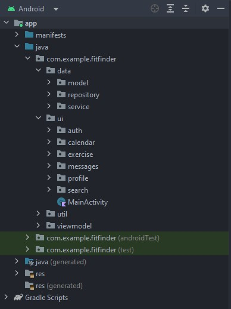
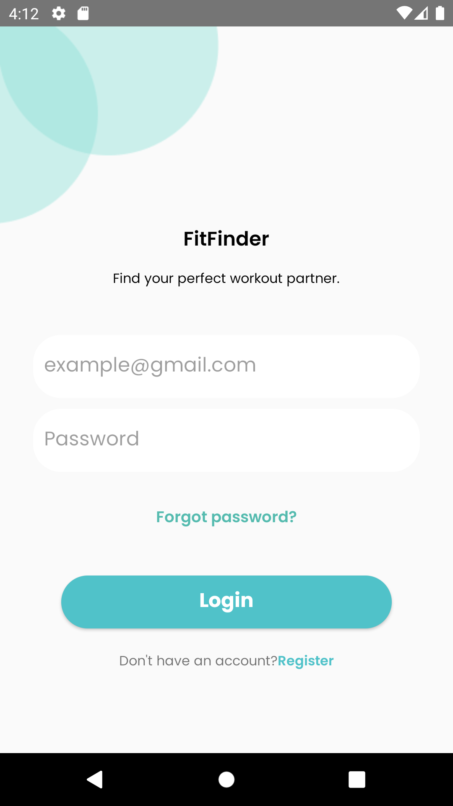
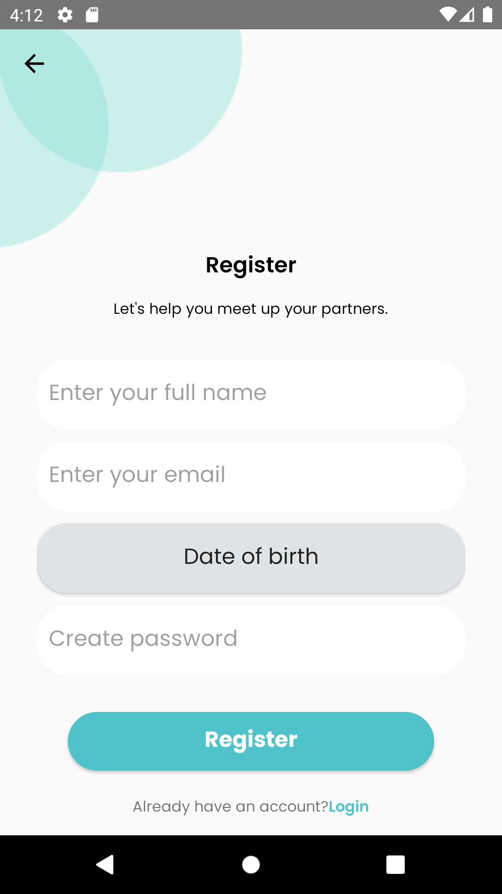
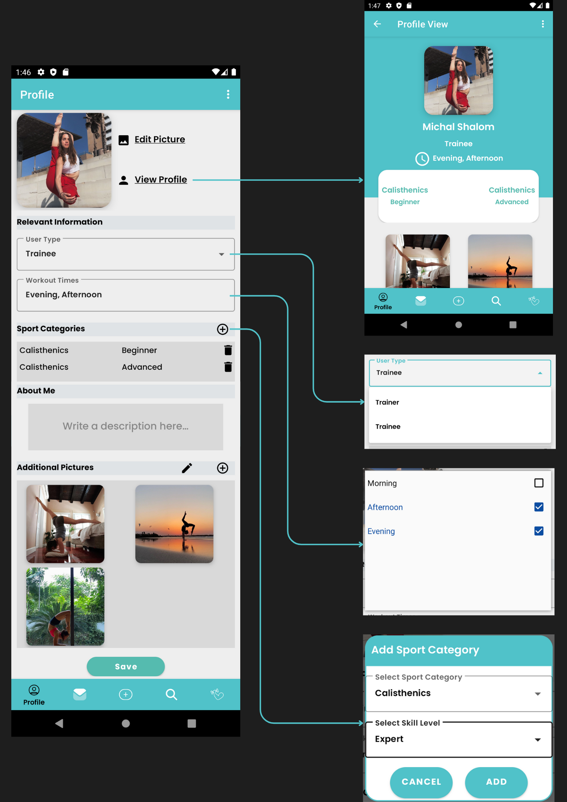
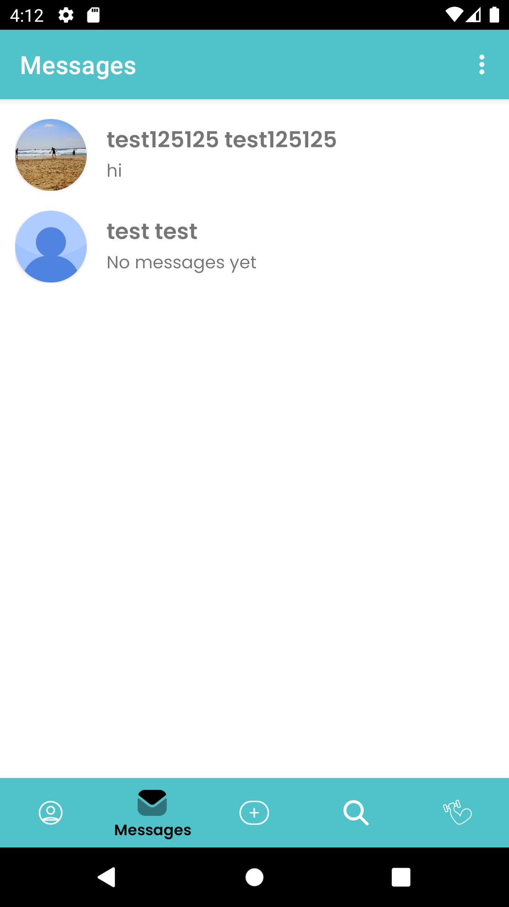
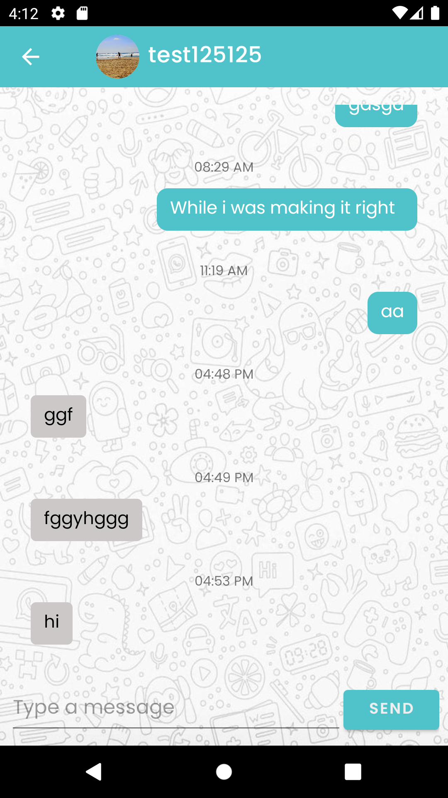
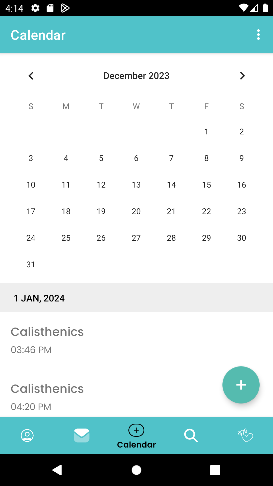
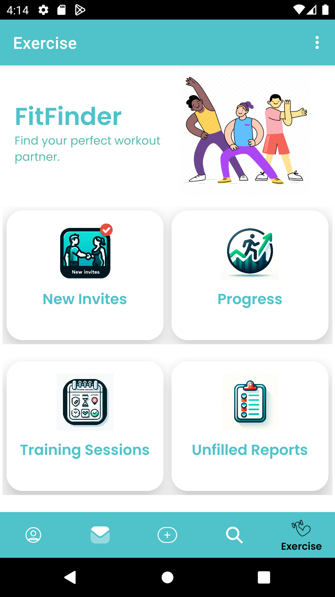

# FitFinder - Find Your Perfect Workout Partner (Still in progress)

Matching app based on the MVVM architecture using Kotlin, ViewModel, LiveData, Coroutines, Navigation and more.

### Prerequisites

The project has all required dependencies in the gradle files. Add the Project to Android Studio or
Intelij and build.All the required dependencies will be downloaded and installed.

## Architecture

The project uses MVVM architecture pattern.

## Libraries

* [ViewModel](https://developer.android.com/topic/libraries/architecture/viewmodel/) - Manage UI
  related data in a lifecycle conscious way and act as a channel between use cases and ui
* [ViewBinding](https://developer.android.com/topic/libraries/data-binding) - support library that
  allows binding of UI components in layouts to data sources,binds character details and search
  results to UI
* [Navigation Component](https://developer.android.com/guide/navigation/navigation-getting-started)
  - Android Jetpack's Navigation component helps in implementing navigation between fragments
* [Kotlin Coroutines](https://developer.android.com/kotlin/coroutines) - Asynchronous programming
* [Firebase](https://firebase.google.com/) - To store data

## Screenshots

### Login | Register
|  |  |
|:---:|:---:|

### Profile

### Messages | Chat
|  |  |
|:---:|:---:|

### Calendar | Create Event
|  |  |
|:---:|:---:|

### Exercise

